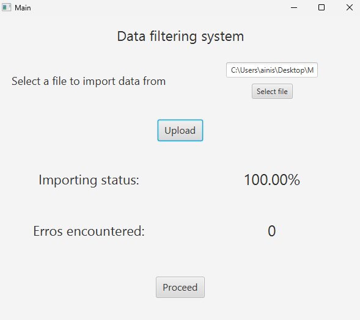
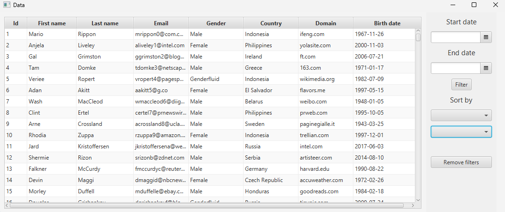

# Multi-thread data filtering application

## Table of Contents
- [About](#about)
- [Installation & setup](#installation--setup)
- [Usage](#usage)
- [License](#license)

## About
This is a multi-thread program that processes .csv file data. The data can later be filtered by certain criteria (id, name, lastname, date and etc.)

## Installation & setup
Download all files and run the main java application.

## Usage

Simply upload the necessary .csv files and filter the data as you please.

## License
This project currently has no license assigned. All rights reserved until a license is chosen.
